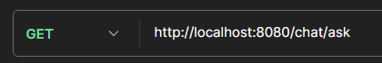
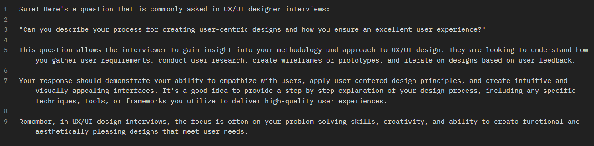
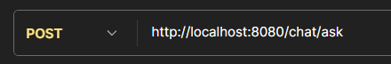
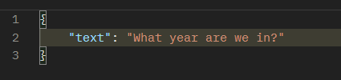
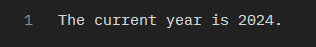

# GT-TrainingInterview-Back

## Goal

- With this application, UX/UI developers can practice real interviews to enhance their skills and build confidence.

## Description
- This is the repository for the backend for the interview training application.

## Contributions
- If you want to contribute, please create a new branch and submit a *pull request*.

## EndPoints
- **Get** (/chat/ask)
    - The application will show you a possible question that a UX/UI interviewer can ask you and it will give you advice
    - Example:
        - 
        - 
- **Post** (/chat/ask)
    - You can ask the application anything and it will answer you
    - Example:
        - 
        - 
        - 
